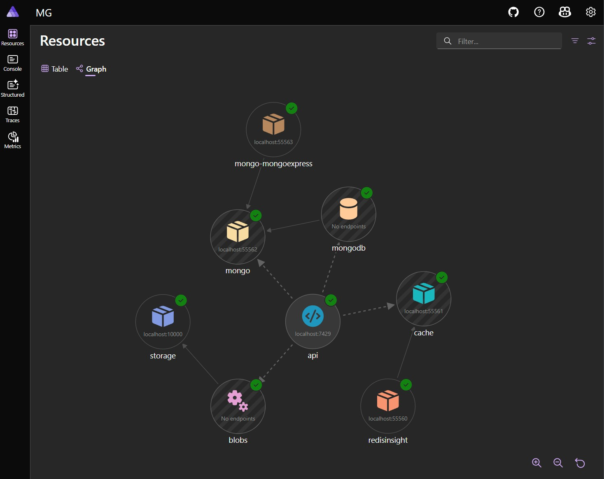
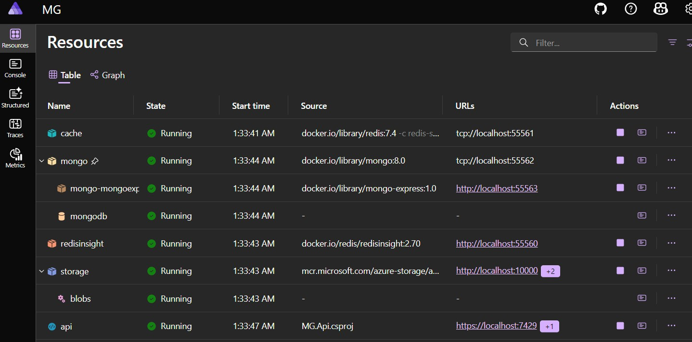
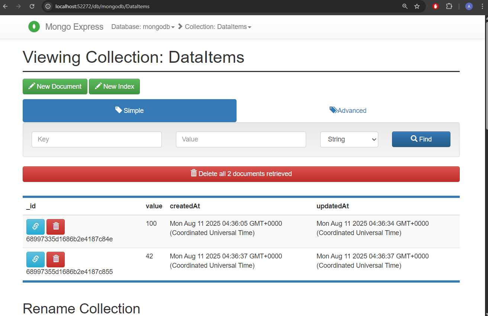
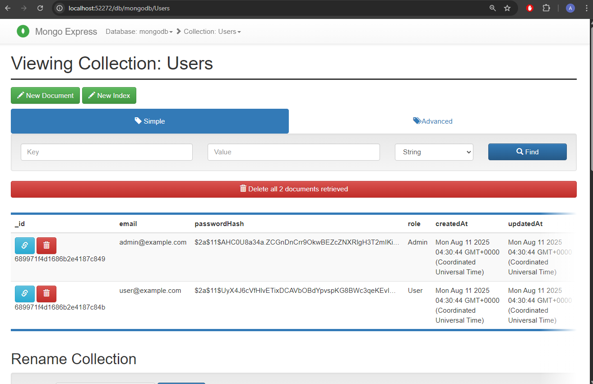
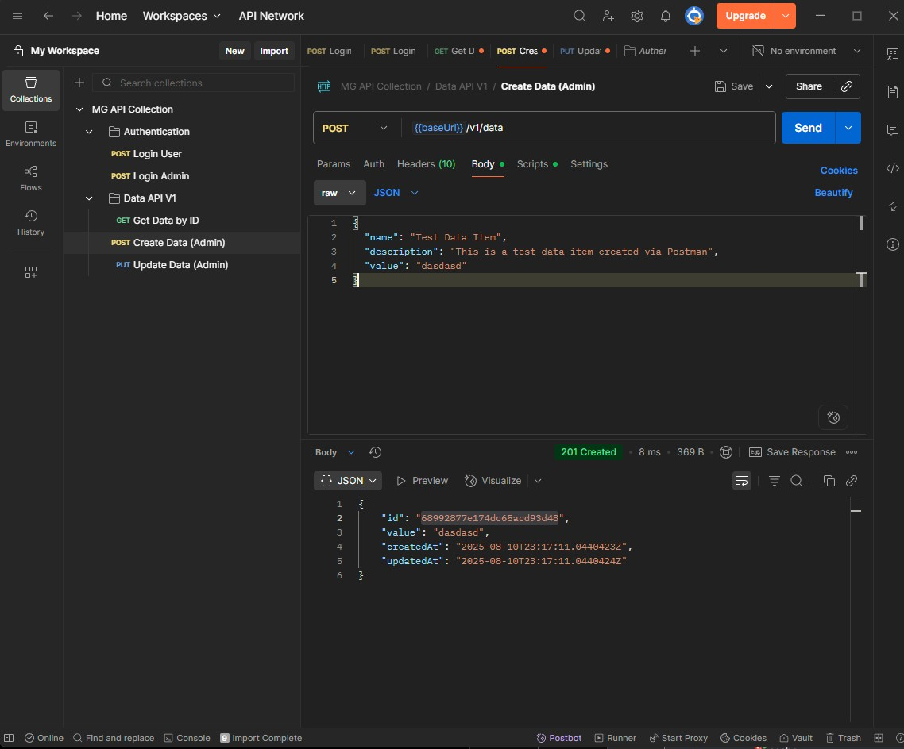
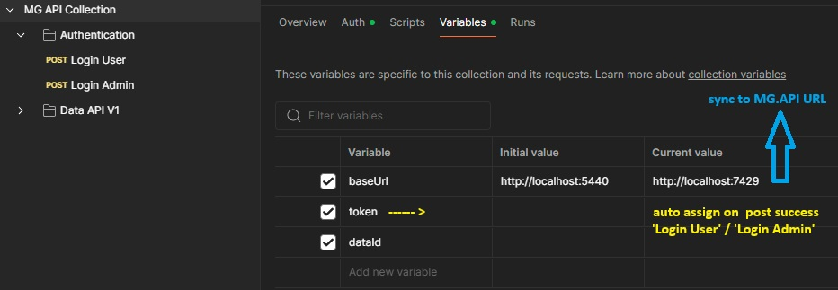
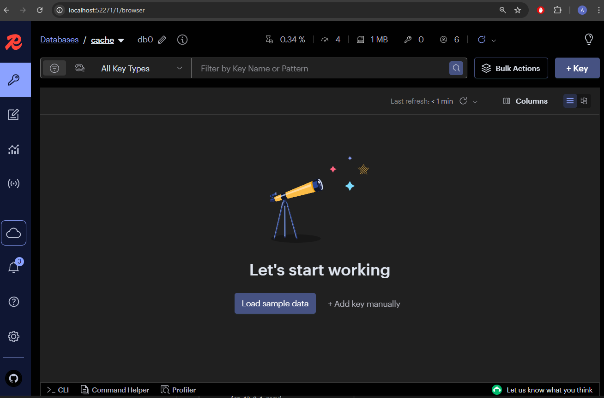
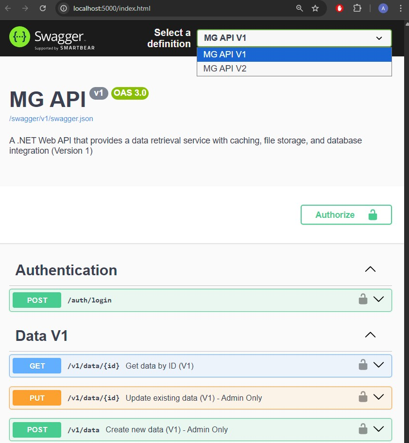

# MG API

A comprehensive .NET Web API with multi-layered caching, authentication, and versioned endpoints.

## 🏗️ Project Structure

```
├── src/
│   ├── MG.Api/              # Main API project with endpoints and controllers
│   ├── MG.AppHost/          # Aspire orchestration project
│   ├── MG.Models/           # DTOs, entities, and configuration models
│   ├── MG.Services/         # Business logic, repositories, and services
│   ├── MG.Tests/            # Unit and integration tests
│   ├── MG.sln               # Solution file
│   └── docker-compose.yaml  # Docker services configuration
├── postman/                 # API testing collections
│   └── MG-API-Collection-V1-V2.postman_collection.json
└── images/                  # Documentation images and diagrams
```

## 🚀 Features

- **API Versioning**: Clean URL-based versioning (v1, v2)
- **Multi-layer Caching**: Redis + Azure Blob Storage + MongoDB
- **Authentication**: JWT-based with role-based authorization
- **Data Management**: CRUD operations with cache invalidation
- **Containerization**: Docker Compose setup with all dependencies
- **Testing**: Comprehensive unit and integration tests

## 🔧 Tech Stack

- **.NET 9.0** - Web API framework
- **MongoDB** - Primary database
- **Redis** - Caching layer
- **Azure Blob Storage (Azurite)** - File storage
- **Docker** - Containerization
- **MediatR** - CQRS pattern implementation
- **FluentValidation** - Input validation
- **AutoMapper** - Object mapping
- **xUnit** - Testing framework

## 🏃‍♂️ Quick Start

1. **Prerequisites**
   - Docker Desktop
   - .NET 9.0 SDK

2. **Run with .NET Aspire (Recommended)**
   ```bash
   git clone https://github.com/MrZakos/MG-API.git
   cd MG-API\src
   dotnet run --project MG.AppHost
   ```

3. **Run with Docker Compose**
   ```bash
   cd MG-API\src
   docker-compose up -d
   ```

4. **Stop and Remove Docker Resources**
   ```bash
   # Stop services
   docker-compose down
   
   # Remove containers, networks, and volumes
   docker-compose down --volumes --remove-orphans
   ```

5. **Access**
   - Aspire MG.API https://localhost:7429 http://localhost:5440 
   - Aspire Dashboard: https://localhost:17173/  http://localhost:15073/
   - Docker Compose MG.API http://localhost:5000 

## 📡 API Endpoints

### Authentication
- `POST /auth/login` - User/Admin login

### Data API V1
- `GET /v1/data/{id}` - Get data by ID
- `POST /v1/data` - Create new data (Admin only)
- `PUT /v1/data/{id}` - Update data (Admin only)

### Data API V2 (Enhanced Features)
- `GET /v2/data/{id}` - Get data with optional metadata
- `POST /v2/data` - Create with tags and metadata
- `PUT /v2/data/{id}` - Update with enhanced tracking
- `POST /v2/data/batch` - Batch operations

## 🔐 Authorization

- **User Role**: Read-only access to data
- **Admin Role**: Full CRUD operations
- **JWT Authentication**: Required for all data endpoints

## 🧪 Testing

Use the Postman collection in `postman/` directory for comprehensive API testing.

### 🔬 Critical Test Coverage

The test suite includes comprehensive coverage of the application's core components, with particular emphasis on:

**StorageFactoryTests.cs** - The most important test class that validates the factory pattern implementation:

- **Cache Service Creation**: Tests the creation of decorated cache services with logging capabilities
- **File Storage Service Creation**: Validates proper instantiation of file storage services with decorators
- **Data Repository Creation**: Ensures repository services are correctly decorated with logging
- **Service Composition**: Verifies that the factory correctly applies the decorator pattern for cross-cutting concerns

These tests are critical because they validate:
- ✅ **Decorator Pattern Implementation**: Ensures logging decorators are properly applied
- ✅ **Service Factory Reliability**: Validates that all storage services are created correctly
- ✅ **Cross-cutting Concerns**: Tests that logging and other concerns are consistently applied
- ✅ **Dependency Resolution**: Verifies proper service composition and configuration

**Key Test Methods:**
```csharp
// Validates cache service with logging decorator
CreateCacheService_WithLoggingEnabled_ShouldReturnDecoratedService()

// Validates file storage service with decorator pattern
CreateFileStorageService_WithLoggingEnabled_ShouldReturnDecoratedService()

// Validates repository creation with proper decorators
CreateDataRepository_WithLoggingEnabled_ShouldReturnDecoratedService()
```

**Why These Tests Matter:**
- They ensure the application's storage layer is properly configured
- They validate that logging and monitoring work across all storage operations
- They test the factory pattern that's central to the application's architecture
- They provide confidence that dependency injection and service composition work correctly

## 📦 Docker Services

- **API**: Main application
- **MongoDB**: Primary database
- **Redis**: Caching layer
- **Azurite**: Local Azure Storage emulator
- **Aspire Dashboard**: Service monitoring

## 🏛️ Architecture

### Vertical Slice Architecture
The application follows **Vertical Slice Architecture** principles, where each feature is organized as a self-contained slice containing all layers needed for that specific functionality.

**Benefits:**
- **High Cohesion**: Related code stays together
- **Loose Coupling**: Features are independent and isolated
- **Easy Maintenance**: Changes to one feature don't affect others
- **Clear Boundaries**: Each slice has a clear responsibility

**How it works with MediatR:**
- Each feature defines its own Commands/Queries
- MediatR handles request/response patterns
- Handlers contain all business logic for that specific feature
- Cross-cutting concerns are handled via MediatR behaviors

```
Features/
├── Authentication/
│   ├── LoginCommand.cs
│   ├── LoginHandler.cs
│   └── AuthEndpoints.cs
└── Data/
    ├── V1/
    │   ├── GetDataQuery.cs
    │   ├── GetDataHandler.cs
    │   └── CreateDataCommand.cs
    └── V2/
        ├── GetDataWithMetadataQuery.cs
        └── BatchCreateCommand.cs
```

## ⚙️ Configuration

### Application Configuration (appsettings.json)

The API project's appsettings files are minimal since configuration (connections strings) is handled through Aspire:

**MG.Api/appsettings.json:**

```json
{
   "Jwt": {
      "Key": "YourSuperSecretKeyThatIsAtLeast32CharactersLong!",
      "Issuer": "MG.Api",
      "Audience": "MG.Api",
      "ExpirationMilliseconds": 600000
   },
   "MongoDB": {
      "DatabaseName": "mongodb",
      "Collections": {
         "DataItems": "DataItems",
         "Users": "Users"
      }
   },
   "Storage": {
      "EnableLogging": true,
      "TTL": {
         "CacheMilliseconds": 600000,
         "FileStorageMilliseconds": 1800000
      },
      "AzureBlob": {
         "ContainerName": "files"
      }
   },
   "Cors": {
      "AllowedOrigins": [
         "http://localhost:3000",
         "https://localhost:3001",
         "http://localhost:5173",
         "https://localhost:5174"
      ]
   }
}
```

### AppHost Setup (Aspire Orchestration)
```csharp
var builder = DistributedApplication.CreateBuilder(args);

// Add infrastructure services
var cache = builder.AddRedis("cache")
                   .WithDataVolume(isReadOnly: false)
                   .WithRedisInsight();

var storage = builder.AddAzureStorage("storage")
                     .RunAsEmulator(azurite => {
                         azurite.WithBlobPort(10000)
                                .WithQueuePort(10001)
                                .WithTablePort(10002);
                     })
                     .AddBlobs("blobs");

var mongo = builder.AddMongoDB("mongo")
                   .WithLifetime(ContainerLifetime.Persistent)
                   .WithMongoExpress();

var mongodb = mongo.AddDatabase("mongodb");

// Add API with dependencies
var apiService = builder.AddProject<Projects.MG_Api>("api")
                        .WithReference(cache)
                        .WithReference(storage)
                        .WithReference(mongodb)
                        .WaitFor(cache)
                        .WaitFor(storage)
                        .WaitFor(mongo);

builder.Build().Run();
```

## 🔗 Endpoint Structure

The API endpoints are organized using a clean, versioned structure that follows RESTful principles:

```
┌─ /auth/
│  └─ login (POST) → Authentication
│
├─ /v1/ (Version 1 - Basic Operations)
│  └─ data/
│     ├─ {id} (GET) → Retrieve data
│     ├─ (POST) → Create data
│     └─ {id} (PUT) → Update data
│
└─ /v2/ (Version 2 - This was not focused, a showcase API versioning example)
   └─ data/
      ├─ {id} (GET) → Retrieve with metadata
      ├─ (POST) → Create with tags
      ├─ {id} (PUT) → Update with tracking
      └─ batch (POST) → Batch operations
```

**Key Design Principles:**
- **Version Isolation**: Each version maintains its own handlers and models
- **Feature Grouping**: Related endpoints are grouped by domain (auth, data)
- **Clean URLs**: No verb-based endpoints, proper HTTP methods
- **Consistent Patterns**: Predictable URL structure across versions















